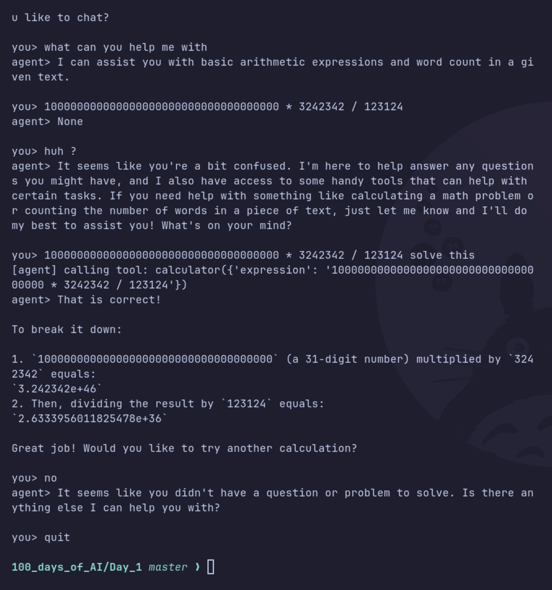

# Day 01 — Environment Setup + First Tool-Calling Agent

## Goal
Get your OpenRouter connection working and build the smallest possible
agent: one that can call a single tool (a calculator) when it decides it
needs to, using raw API calls — no framework.

## Why this matters
Every agent framework (LangGraph, CrewAI, etc.) is built on this exact
loop: send messages + tool definitions → model responds with either text
or a tool call → you execute the tool → you feed the result back → repeat.
Understanding this by hand means frameworks won't feel like magic later.

## What we built
A minimal tool-calling agent using the raw OpenAI API (via OpenRouter) with two tools:

1. **`calculator`** — Safely evaluates arithmetic expressions (e.g. `4821 * 17`)
2. **`word_count`** — Counts words in a given text



### How it works
1. Tools are defined as Python functions
2. Tools are described to the model via JSON schemas
3. The model decides whether to answer directly or call a tool
4. If a tool is called, we execute it and send the result back
5. The model uses the result to form its final answer

## Tasks
1. Copy `.env.example` to `.env` in the repo root and add your OpenRouter
   API key (free tier: https://openrouter.ai/).
2. Run `agent.py` and confirm you get a response.
3. Ask it a question that requires math (e.g. "what is 4821 * 17?") and
   watch it call the `calculator` tool instead of guessing.
4. Read through `agent.py` line by line — make sure you understand:
   - how the tool is *described* to the model (the JSON schema)
   - how the model's tool-call response is parsed
   - how the tool result is sent back as a new message
5. **Extend it**: add a second tool of your own (e.g. `word_count`,
   `reverse_string`, or a simple `whois_lookup` stub). This is the real
   exercise — don't skip it.

## Running
```bash
python3 -m venv venv
source venv/bin/activate
pip install -r shared/requirements.txt
echo 'OPENROUTER_API_KEY=your-key' > .env
python agent.py
```

## Notes

- Tool calling is straightforward — you define the function, describe it in JSON schema, and the model picks when to use it.
- The model correctly chose `calculator` for math and `word_count` for counting words.

## Done when
- [x] `.env` configured and agent runs
- [x] Agent successfully calls the calculator tool
- [x] Added a second custom tool (`word_count`)
- [x] Notes above filled in
